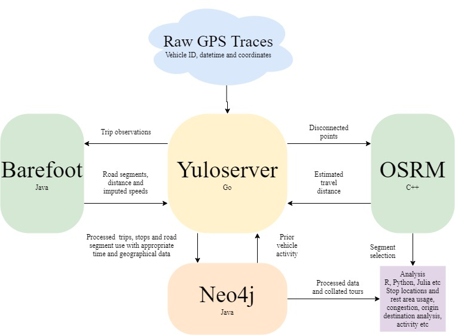

This repository holds code for the BITRE telematics project, specifically the processing code known as Yulo. It does not contain any telematics data.

Yulo takes raw GPS traces for vehicles in Australia and defines trip and stop events given user parameters. Observations in trip events are then matched to a road network so that each observation is associated with a unique road segment where the vehicle was observed and any road segments used between that observation and the prior observation. Stop events are also matched to known locations (rest areas and addresses). The resulting data is then uploaded to a Neo4j graph database for further analysis. This process was originally described in [Green and Mitchell, 2018](https://www.australasiantransportresearchforum.org.au/sites/default/files/ATRF2018_paper_18.pdf).

It is licenced under a Creative Commons licence - Attribution-NonCommercial 4.0 International (CC BY-NC 4.0)

Installation requirements (including shapefile data and dependencies) are theoretically installed with the relevant bash scripts in `bashscripting/`. In future docker containers will make this easier. Currently the code assumes Linux is being used, although individual components endeavour to be platform independent.

`wiki/` includes a zim wiki with miscellaneous documentation that may be out of date.

Data is processed from a CSV that includes at least the following fields (take note of captialisation)
```
	Vehicle - String - A unique Vehicle/Asset identifier
	Datetime - int - datetime in unix epoch (UTC) of the observation
	lat - float - latitude of the observation
	lon - float - longitude of the observation
```
Optionally it may also include
```
	Azimuth - int - bearing or direction of vehicle in degrees (0-259).
	Speed - float - speed in kph of the observation
```
All other fields are ignored.

You will need to create a Neo4j database (with receiving server if using LOAD_CSV) either locally or on another machine and then add the ip, port number and credentials to config.yaml and creds.yaml files in goyulo/src/yuloserver
Once data is in the requistite format as described in TripGrouping or the wiki and relevant credential files are created.


Run 
`sudo bash bashScripting/installations.sh`

`sudo bash bashScripting/server_update.sh && bash bashScripting/start_db_server.sh`

(If this fails to update and start OSRM recompile the binaries as described in the directory osrm or unhash the relevant lines in the above two scripts to use Docker instead)

Then


```
cd yuloserver
go mod download
go run main.go
```
then in another window
```
cd ../guyulo/src/yuloserver
python3 yuloserver_feed.py -f <filestem>
```
Where `<filestem>` is the common string in csv files in the `data/` folder that are to be processed. The CSVs may be in gz archives.
	
One can also, in the yuloserver folder, build a docker image of the go process
```
sudo docker build -t yuloserver ./
sudo docker run  -p 6969:6969 --network="host" --name="yuloserver" -v ${PWD}/../../../shapefiles/:/shapefiles -v ${PWD}/../../../data/:/data yuloserver 
```
The interaction of the different elements is roughly sketched below.



We are indebted to `https://github.com/bmwcarit/barefoot`, the code of which we have adapated.


`server_update.sh` assumes matching will be performed on OpenStreetMap data. This can be circumvented to use other data by creating an osm formatted xml file. This can be done using the tool `geojson2osm2` javascript tool as such
```
npm i https://github.com/BITRE-Telematics/geojson2osm2
npx geojson2osm2 original.geojson > barefoot/map/osm/australia.osm

```

and altering `server_update.sh` to use execute `import_xml.sh` in place of `import.sh`, as well as directing osrm to extract from the osm file rather than osm.pbf. Note the geojson must include `highway` tags that are accounted for in `road-types.json` which can be edited as needed.
